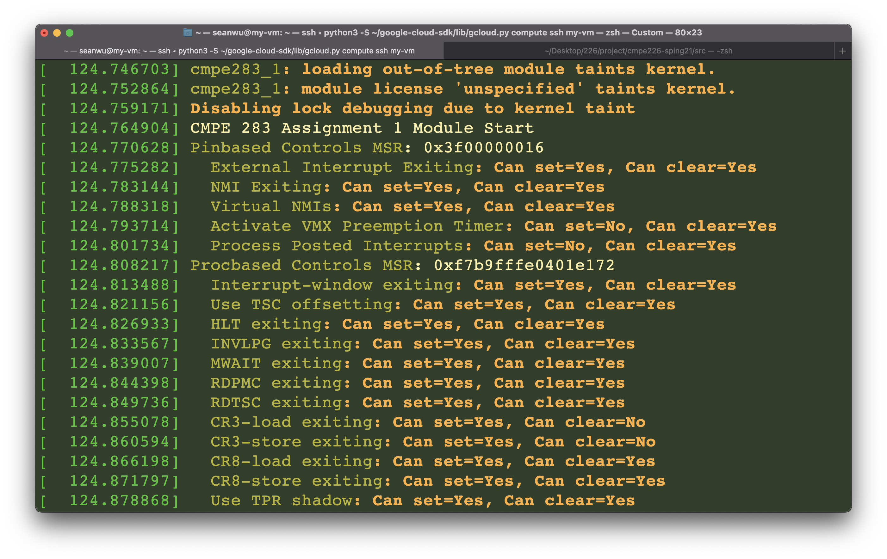
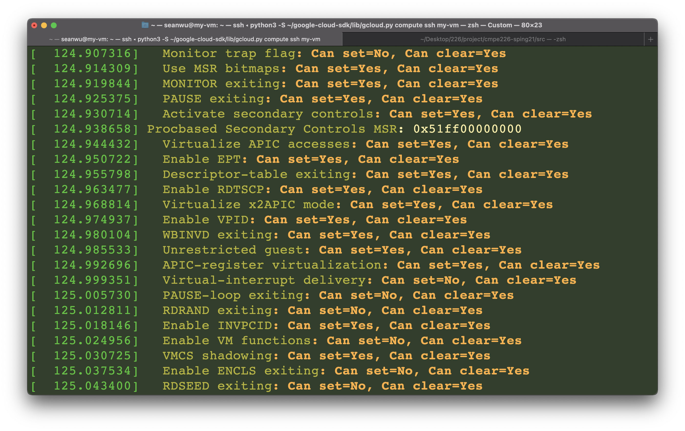

## I'm the only team member :/

## Steps to replicate assignment 1:

### Prerequisite: gcp vm instance up and spinning. 

### https://cloud.google.com/compute/docs/instances/enable-nested-virtualization-vm-instances

```shell
$ uname -mrs # or uname -a
# Linux 4.19.0-14-cloud-amd64 x86_64

$ sudo apt-get update  

$ sudo apt-get upgrade

$ sudo apt-get install build-essential libncurses-dev bison flex libssl-dev libelf-dev git

$ git clone https://github.com/Sean-Wu-TW/linux.git

$ cd linux

$ git checkout v4.20                        # use version 4.20 to avoid errors

$ cp -v /boot/config-$(uname -r) .config    # load pre-exist config file into new VM
# change .config file field 
# CONFIG_SYSTEM_TRUSTED_KEYS = "" 
# CONFIG_MODULE_SIG=n 
# CONFIG_MODULE_SIG_ALL=n

$ make oldconfig 

$ make -j 2 # use 2 cores to compile faster
            # press enter all the way
            
$ sudo apt-get install bc   # if receive this error --> /bin/sh: 1: bc: not found

$ sudo make modules_install 

$ sudo make install       

# or even better:
# make -j 8 modules && make -j 8 && sudo make modules_install && sudo make install

$ sudo reboot    # reboot, on GCP reset

$ uname -mrs 
# Linux 4.20.0-rc6+ x86_64

# put 'cmpe283-1.c' and 'Makefile' into "ass1" folder, then cd into it

$ make              # compile module, some .ko/.o files generated

$ insmod cmpe283-1.ko # load module

$ dmesg             # see output

$ rmmod cmpe283-1.ko  # unload module

```


### Some problems I've faced:

1.  Seems like the newer versions of kernel does not allow insertion of unsigned modules, which leads to an error(unable to `insmod`).
2.  Same as 1, newer kernel(v5.x or above) could not `make` a module, whereas in v.4.x only leads to warning.(See homework how to video). `.ko` kernel object file not generated.







##### Notes for myself:

https://cloud.google.com/compute/docs/instances/enable-nested-virtualization-vm-instances

Set `gcloud` project to `cmpe283`, then type: `gcloud compute ssh my-vm`

Config kernel: https://www.cyberciti.biz/tips/compiling-linux-kernel-26.html

Getting: `No rule to make target 'debian/certs/test-signing-certs.pem', needed by 'certs/x509_certificate_list'.  Stop. `: https://wiki.debian.org/BuildADebianKernelPackage

### Using your current Debian kernel configuration as a starting point

Alternatively, you can use the configuration from a Debian-built kernel that you already have installed by copying the `/boot/config-*` file to `.config` and then running `make oldconfig` to only answer new questions.

If you do this, ensure that you modify the configuration to set:

```
CONFIG_SYSTEM_TRUSTED_KEYS = ""
```

##### If can't insert module

https://stackoverflow.com/questions/24975377/kvm-module-verification-failed-signature-and-or-required-key-missing-taintin

```shell
CONFIG_MODULE_SIG=n
CONFIG_MODULE_SIG_ALL=n
# CONFIG_MODULE_SIG_FORCE is not set 
# CONFIG_MODULE_SIG_SHA1 is not set
# CONFIG_MODULE_SIG_SHA224 is not set
# CONFIG_MODULE_SIG_SHA256 is not set
# CONFIG_MODULE_SIG_SHA384 is not set
```

