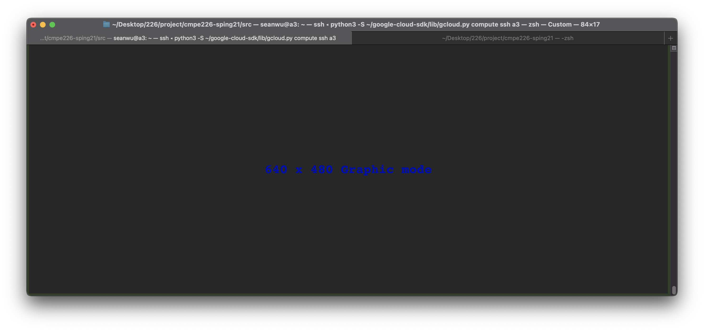

### I re-did the assignment 2 bc I thought the previous version was wrong

### 1. I'm the only team member

### 2. Steps to finish this assignemt:
- Have a working assignment 2
- Modify the kvm_emulate_cpuid function inside cpuid.c to add a 0x4ffffffe block

#### Comment on the frequency of exits – does the number of exits increase at a stable rate?

The number of exits does not seems to increase at a stable rate. 

#### Or are there more exits performed during certain VM operations?

External Interrrupt, Interrupt Window , Control-register access, and IO seems to have a lot of exits.

#### Approximately how many exits does a full VM boot entail?

Roughly 500k.


### What to do in assignment-3:

```c
int kvm_emulate_cpuid(struct kvm_vcpu *vcpu)
{
	u32 eax, ebx, ecx, edx;

	if (cpuid_fault_enabled(vcpu) && !kvm_require_cpl(vcpu, 0))
		return 1;

	eax = kvm_rax_read(vcpu);
	ecx = kvm_rcx_read(vcpu);
	
	if (eax == 0x4fffffff){
		printk("Now in 0x4ffffff");
		kvm_cpuid(vcpu, &eax, &ebx, &ecx, &edx, true);
		eax = exit_counts;
		ecx = exit_delta & 0xffffffff;
		ebx = (exit_delta >> 32) & 0xffffffff;
	}else if ( eax == 0x4ffffffe ) {
		uint32_t s_count;
		// if 0 <= ecx <= 68
		if (ecx >= 0 && ecx <= 68 && ecx != 65 && ecx != 42 && ecx != 38 && ecx != 35){
			if (eax == 3 || eax == 4 || eax == 5 || eax == 6 || eax == 16 || eax == 11 || eax == 17 || eax == 16 || eax == 33 || eax == 34 || eax == 51 || eax == 54 || eax == 63 || eax == 64 || eax == 66 || eax == 67 || eax == 68 ) {
				printk(KERN_INFO "exit reason number=%u not enabled in KVM", ecx);
				eax = ebx = ecx = edx = 0;
			} else {
				// return exit count
				eax = exit_counter[ecx];
				printk(KERN_INFO "exit reason number=%u, exit counter eax=%u", ecx, eax);
				s_count = exit_counter[ecx];
				printk(KERN_INFO "exit number %d exits= %d\n", ecx, s_count);
			}
		} else {
			// exit not defined
			printk(KERN_INFO "exit reason number=%u not defined in SDM", ecx);
			eax = ebx = ecx = 0;
			edx = 0xFFFFFFFF;
		}
	}else {
		kvm_cpuid(vcpu, &eax, &ebx, &ecx, &edx, false);
	}
	kvm_cpuid(vcpu, &eax, &ebx, &ecx, &edx, false);
	kvm_rax_write(vcpu, eax);
	kvm_rbx_write(vcpu, ebx);
	kvm_rcx_write(vcpu, ecx);
	kvm_rdx_write(vcpu, edx);
	return kvm_skip_emulated_instruction(vcpu);
}
```


### Problems I've ran into:

-   I tried to declare `exit_counts` in `cpuid.c` but failed, kept receiving undeclare error, then I declared it in the header file of cupid.

```c
/* In cpuid.h */
#include <uapi/asm/kvm_para.h>

extern u32 exit_counter[];

extern u32 kvm_cpu_caps[NR_KVM_CPU_CAPS] __read_mostly;

```
-   Got stuck in 640 x 480 Graphic mode vm when trying to start a nested vm to test cpuid.



